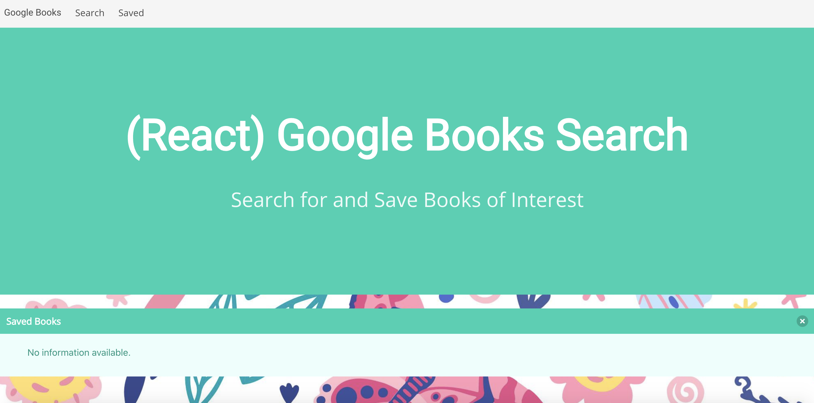

# (React) Google Books Search

## Table of Contents
*  [Description](#description)
*  [User Story](#user-story)
*  [Features of the Application](#features-of-the-application)
*  [Preview of the (React) Google Books Search](#preview-of-the-react-google-books-search)
*  [Links](#links)
*  [Usage](#usage)
*  [License](#license)
*  [Contributing](#contributing)
*  [Questions](#questions)

## Description

The (React) Google Books Search application is a React-based Single Page Application (SPA) that works with helper/util functions and utilizes the React lifecycle methods to query - via the Google Books API - and display books based on user searches. The user can then view additional details of the queried book on the Google Books website or save a book to the backend via MongoDB. Users can also view all of their saved books, with the option to delete the book from the backend.

The (React) Google Books is a MERN application. It utilizes MongodDB (a NoSQL document-oriented database), Express routing, and Node. It also utilizes React, a Javascript library, to build the application and required the breakdown of the user interface into components, managing the component state, and responding to user events.

## User Story
~~~
AS A user  
I WANT to be able to query a book title  
SO THAT I can view details about the book and gain additional details while having the option to save and delete my library of books.  
~~~

## Features of the Application
~~~
GIVEN a Google Books search application  
WHEN I query a book title
THEN books that are related to my query will be displayed. 

WHEN I click on a book's View button  
THEN I should be able to view additional details of the book via Google Books.  

WHEN I click on a book's Save button  
THEN I should be able to save the selected books to my Saved Books section.  

WHEN I click on a book's Delete button  
THEN I should be able to remove the selected book from my Saved Books section.  
~~~

## Preview of the (React) Google Books Search

The following animation demonstrates the application's search and save functionality:

The following animation demonstrates the application's search and view functionality:

The following animation demonstrates the application's delete functionality:

## Links

1. [Deployed Application](https://explore-google-books.herokuapp.com/)

2. [Github Repository](https://github.com/rh9891/GoogleBooksSearch)

## Usage

The application can be initiated by inputting `npm start` into the command line interface and running the application on `localhost: 3000`.

## License

This application does not currently have any licenses.

The user is not permitted to use, modify, or share any parts of it. Though the code for this application is hosted on Github, where you are allowed to view and fork the code, this does not imply that the user is permitted to use, modify, or share the contents of this application for any purpose.

## Contributing

If you would like to contribute to this repository, please contact me via [Github](https://github.com/rh9891).

## Questions

If you have any questions, comments, or issues regarding this application, please do not hesitate to contact me through [Github](https://github.com/rh9891).